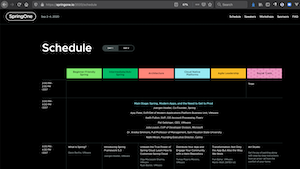
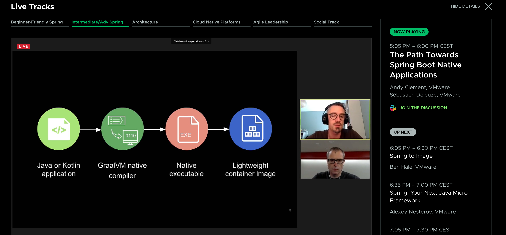
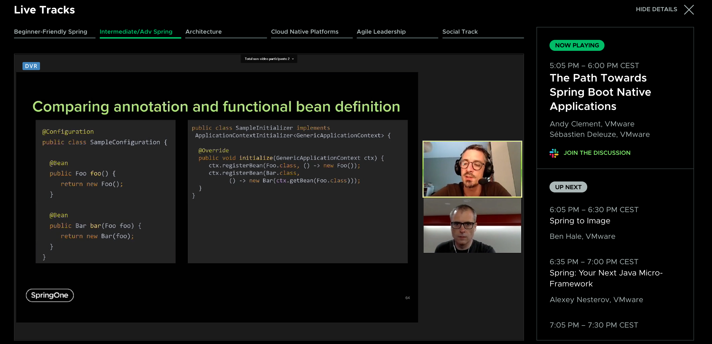
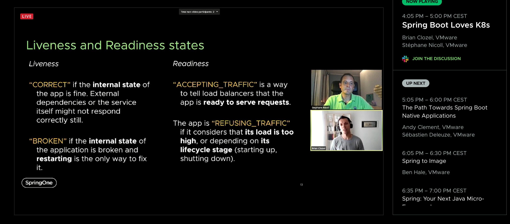

# springone-2020-highlights
Notes about my personal highlights of SpringOne 2020

[](https://springone.io/2020/schedule)


## Table of Contents 

* [General observations](#general-observations)
* [Spring Boot Build Packs / Paketo.io](#spring-boot-build-packs--paketoio)
* [Spring Boot & GraalVM](#spring-boot--graalvm)
* [Spring Boot K8s Support](#spring-boot-k8s-support)

---


### General observations

Find all video-recordings at https://springone.io/2020/schedule (you need to create an account, but most are also on Youtube)

* Pivotal is now --> VMWare Tanzu

* As Kubernetes becomes Industry-Standard, Pivotal Cloud Foundry is now legacy --> and VMWare Tanzu (Kubernetes Grid, see [heise.de](https://www.heise.de/ix/meldung/Fuer-Cloud-Entwickler-VMware-bringt-vSphere-7-und-Tanzu-auf-den-Markt-4672272.html)) is now the thing

* Everything: Buildpacks!


---


### Spring Boot Build Packs / Paketo.io

<a href="http://www.youtube.com/watch?feature=player_embedded&v=44n_MtsggnI
" target="_blank"></a>

__*"Spring to Image"*__ by https://twitter.com/nebhale / https://springone.io/2020/sessions/spring-to-image


> Dockerfiles are super flexible, what is their weakness at the same time

> Build Packs (Heroku invented 2011), Cloud Foundry mainstreamd from 2013

> CNCF-Project: Specification how to turn Applications into Docker Images

https://www.cncf.io/blog/2020/11/18/toc-approves-cloud-native-buildpacks-from-sandbox-to-incubation/

> like Jib https://github.com/GoogleContainerTools/jib, ko https://github.com/google/ko, Bazel (https://bazel.build/)

__--> More details: https://github.com/jonashackt/spring-boot-buildpack__


---


### Spring Boot & GraalVM

<a href="http://www.youtube.com/watch?feature=player_embedded&v=Um9djPTtPe0
" target="_blank"></a>

__*"The Path Towards Spring Boot Native Applications"*__ by https://twitter.com/sdeleuze & https://twitter.com/andy_clement

currently supported (0.8.x):

* actuator
* Cache
* Data JPA, R2DBC...
* JDBC
* Logging (Logback)
* Thymeleaf
* Validation
* Web (Spring MVC with Tomcat)
* Webflux (Netty)
* Wavefront
* Spring Cloud Function

> Roadmap: 0.9.x & Beta status Dec 2020



because of native image, Bean Registration becomes functional Style 

> Functional Bean Registration reduced startup times by ~ 50%, executable also ~ 50%



> generator from @Configuration bean registrations to functional Style: https://github.com/spring-projects-experimental/spring-init


__--> More details: https://github.com/jonashackt/spring-boot-graalvm__

https://blog.codecentric.de/en/2020/05/spring-boot-graalvm/


---


### Spring Boot K8s Support

<a href="http://www.youtube.com/watch?feature=player_embedded&v=nPACI6-J9Jc
" target="_blank"></a>


__*"Spring Boot Loves K8s"*__ by https://twitter.com/bclozel & https://twitter.com/snicoll

--> Example Code: https://github.com/snicoll/spring-boot-loves-k8s


##### Layered jars & Build Packs

see [Spring Boot Build Packs / Paketo.io](#spring-boot-build-packs--paketoio) :)

kpack Kubernetes service


##### Health States

Concept: 
* Liveness (Correct, Broken)
* Readiness (Accepting Traffic, Refusing Traffic)



+ new programming model inkl. Reactive Endpoints "recover" Exceptions, which will be delivered to the frontend, when specific state is reached

- `AvailabilityChangeEvent`, if state of the App changed --> really cool!


##### Graceful Shutdown

New property: 

```shell script
server.shutdown=graceful
```

--> With this the app will response to all requests, that were received until this point --> and shutdown only, wenn they are send


##### Spring Boot 2.4+

```shell script
spring.config.activate.on-cloud-platform=kubernetes
```

optimize graceful shutdown more (for when routing state is changing, but routing traffic is still send to apps)

layered jars index default, metadata for CI/CD pipelines


